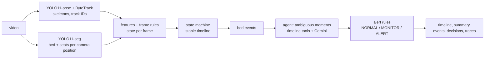

# person-pose-analyser

Analyses a fixed-camera bedroom video of an elderly person and works out what
they're doing over time, when they leave or return to bed, how long they
spend in each state, and whether the situation is **NORMAL**, needs
**MONITOR**ing, or needs an **ALERT**.

YOLO11-pose looks at every sampled frame, a state machine turns the
per-frame guesses into a timeline, and an agent investigates only the
ambiguous moments: it looks back and forward in time and can ask Gemini to
look at the frames. Alert decisions are made by plain rules, never by the LLM.

On my 13-minute test recording: **89% per-second state accuracy, 98% in/out
of bed**, every real bed exit and return found within 4 s, lying time
measured within 3 s over 6 minutes. Details and failure cases below.

## How it works



1. **Perception.** About 5 frames per second go through YOLO11n-pose (17
   keypoints per person) with ByteTrack, so each person keeps an ID. Results
   are cached, so everything after this step reruns in seconds.
2. **Scene.** YOLO11s-seg finds the bed and seats (chair, couch, bench) on
   ~20 frames and merges them into outlines. If the camera gets nudged
   (detected by phase correlation every 2 s), the scene is detected again
   for the new position.
3. **Patient.** The track that spends most time in or near the bed; new track
   IDs after occlusions or leaving the room are re-linked to it.
4. **Frame rules.** Torso and thigh angles, hips in bed / on a seat, hip speed
   and keypoint confidence give a state, a confidence and a reason for each
   frame. UNKNOWN when there isn't enough evidence.
5. **State machine.** Confidence-weighted vote, a minimum time per state
   before a change is accepted (back-dated to when it really started), a
   short "still in bed under the blanket" hold, and OUT_OF_BED only after a
   confirmed bed exit.
6. **Bed events.** Exit = in bed, then up, then moving away for 3 s. Return =
   out of bed, then on the bed and lying down (or 10 s sitting). Sitting up,
   edge sitting and a brief stand don't count.
7. **Agent.** Triggers (possible fall, low-confidence bed event, unknown
   stretch, second person, flicker) wake a bounded Reason-Act-Observe loop,
   at most 4 tool calls: `look_back`, `look_forward`, `check_bed_overlap`,
   `get_pose_summary`, `count_people`, `ask_vlm`. The next tool is chosen by
   fixed rules (offline) or by Gemini via function calling. Every
   investigation is written as a readable trace.
8. **Alerts.** Fixed rules from config (see below).

More: [docs/architecture.md](docs/architecture.md), and
[docs/decisions.md](docs/decisions.md) for every design choice, the
alternatives, and what changed after testing.

## Setup

Python 3.10+. Tested on Windows with an NVIDIA GTX 1650 Ti (4 GB); CPU works too, just slower.

```bash
python -m venv .venv
.venv\Scripts\activate          # Windows
# source .venv/bin/activate     # Linux/macOS

# GPU: install the CUDA build of torch first (pick the right one at pytorch.org)
pip install torch torchvision --index-url https://download.pytorch.org/whl/cu126

pip install -r requirements.txt
python -m pytest                # 171 tests, no video or API key needed
```

YOLO weights download automatically on the first run.

**Gemini (optional).** Copy `.env.example` to `.env` and set `GEMINI_API_KEY`
(from Google AI Studio). Vertex AI also works: set `vlm.provider: vertex` or
`--vlm vertex`, plus the project and service-account variables in `.env`.
Without a key the pipeline runs fully offline and says so.

Models: with an API key the default is `gemini-3.5-flash` (fallback
`gemini-3.5-flash-lite`); new AI Studio keys no longer get the 2.5 models,
and `gemini-3.8-flash` allows only 20 free requests per day. On Vertex it uses
`gemini-2.5-flash` / `-lite`. Both are set in `configs/default.yaml`. Gemini
is only called for the few ambiguous moments, and answers are cached in
`cache/`, so the free tier is enough.

## Usage

```bash
python -m src.main --video data/videos/room1.mp4 --out outputs/room1
```

| Option | |
|---|---|
| `--start 10 --end 48` | analyse only part of the video |
| `--vlm none\|aistudio\|vertex` | Gemini provider (default `aistudio`); `none` = offline |
| `--policy rules\|llm` | agent picks tools by fixed rules, or Gemini chooses (function calling) |
| `--no-agent` | skip the agent, to compare with and without it |
| `--annotate` | also write `annotated.mp4` (skeleton, bed, state, decision) |
| `--rerun` | recompute cached detections |
| `--scene file.json` | use a hand-drawn bed (`tools/draw_bed_polygon.py`) instead of the detected one |

Outputs, in the output folder (examples from my test video in [examples/test2](examples/test2)):

| File | Content |
|---|---|
| `timeline.txt` | `00:06 – 05:14  LYING_IN_BED  NORMAL`, one line per segment |
| `summary.json` | time per state (seconds and `"6m 18s"` style), in/out of bed, exit/return counts, longest out-of-bed period, final state |
| `events.json` | bed exits and returns: start and confirmed time, previous/current state, confidence, decision, agent trace id |
| `decisions.json` | overall decision, each fired rule with its reason, decision over time |
| `agent_traces.txt` | each investigation: Observation, Thought, Action, Finding, Conclusion |
| `bed_status.txt` | coarse timeline: `IN_BED` / `OUT` |
| `frame_states.csv` | every sampled frame: measurements, raw and final state, reason |

Time in bed = lying + sitting on the bed. Everything else, including UNKNOWN,
counts as out of bed, so in + out always equals the analysed duration;
unknown time is also reported on its own.

A typical agent trace (my bed exit, confidence 0.17 because my legs were out of frame):

```
Observation: bed_exit detected at 00:20 (sitting_on_bed -> walking) but confidence is only 0.17.
Thought:     Current frames are not enough to be sure this is a real bed_exit. Check what happened before.
Action:      look_back(t=19.8, seconds=10.0)
Finding:     lying_in_bed 1.4s, then sitting_on_bed 8.6s
Thought:     Now check what happens after.
Action:      look_forward(t=19.8, seconds=15.0)
Finding:     standing 2.8s, then walking 9.6s, then standing 2.6s
Conclusion:  CONFIRMED (confidence 0.95)
Decision:    MONITOR
```

## Alert rules

Decisions come from fixed rules, not the LLM, so every alert is explainable
and testable. Reasoning per rule: [docs/alert_rules.md](docs/alert_rules.md).

| Level | When |
|---|---|
| NORMAL | lying, sitting, standing or walking, none of the below |
| MONITOR | sitting on the bed > 3 min; activity unknown > 1 min; any confirmed bed exit (until back in bed); out of bed > 10 min |
| ALERT | lying outside the bed > 20 s (possible fall); away from bed > 20 min |

A caregiver in view lowers the absence rules by one level, never the fall alert.

## Results

Evaluated on a 13-minute recording of myself acting out most of the
assignment's difficult cases, labelled by hand, 739 s scored
([docs/evaluation.md](docs/evaluation.md), full tables in
[docs/evaluation_results.md](docs/evaluation_results.md)):

| Run | State accuracy | In/out of bed | Bed exit P / R | Return P / R |
|---|---|---|---|---|
| no agent | 80% | 88% | 33% / 100% | 50% / 100% |
| agent, rule policy | **89%** | **98%** | 33% / 100% | 50% / 100% |
| agent, Gemini chooses the tools | 81% | 90% | 33% / 100% | 50% / 100% |

- The agent adds 9 points, mostly by working out that I was still in bed
  during 59 s fully under the blanket, when YOLO saw nobody.
- Duration errors: lying 3 s, sitting on bed 1 s, chair 17 s, standing 24 s,
  walking 14 s.
- The false exits come from standing *on* the bed and from the fall off the
  bed. Asked afterwards, Gemini identified both correctly; the agent didn't
  ask because geometry was confidently wrong.
- The Gemini-driven agent did worse than the fixed policy: for the blanket
  stretch its reasoning said "remained in bed" but its answer was UNKNOWN.

**Caveat:** I fixed two problems (lying along a diagonal bed, the camera
being nudged) while looking at this same video, so these numbers are
optimistic. A recording I never tuned on would be the fair test.

Failure cases with frames: [docs/failure_cases.md](docs/failure_cases.md).

## Limitations and what I'd do with more time

- **Ask the VLM at the right moments.** The biggest gap. Every bed event should
  go to the agent (a handful per night), and a patient disappearing at the bed
  edge should trigger it. The VLM answer needs an "on the bed / on the floor"
  field so "standing on the bed" can be expressed.
- **Falls hidden by the bed** are missed, and the blanket hold makes it worse
  by assuming the person is still in bed. Safety-critical, first thing to fix.
- **Darkness** turns into "out of view". It should be UNKNOWN ("can't see"),
  and real use needs an infrared camera.
- **Only one labelled video**, me rather than an elderly patient, no caregiver
  in the evaluated recording. I'd record a held-out set and several rooms.
- **Standing vs walking** at slow speed is the weakest pair; a short temporal
  model over keypoints would beat a speed threshold.
- **Single camera, 2D.** A depth camera or a second view would remove most of
  the perspective tricks in the rules.
- **Re-identification.** A caregiver walking in alone while the patient is out
  of view would be taken for the patient; appearance features would fix it.
- **Real time.** The pipeline analyses a recorded video (the agent may look
  forward in time). A live version would run perception continuously and
  confirm events after a short delay, which `confirmed_time` already models.

## Licence note

YOLO11 (Ultralytics) is AGPL-3.0, which matters if this were deployed as a
service.
