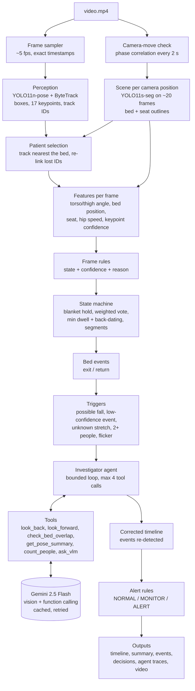

# Architecture

`perception.jsonl` and `scene.json` are cached in the output folder, so
everything from "Patient selection" down reruns in seconds.

Editable version of the diagram: [architecture.drawio](architecture.drawio)
(open in draw.io / diagrams.net).

## The idea

| Layer | Does | Why this way |
|---|---|---|
| YOLO11-pose | Who is where, and their skeleton, every frame | Fast and cheap, but only geometry |
| YOLO11-seg | Where the bed and seats are, once per camera position | Furniture doesn't move; a mask follows a slanted bed, a box doesn't |
| Rules + state machine | Posture per frame, then a stable timeline | Explainable, tunable in one config file; bed events are sequences, not frames |
| Agent | Looks into the few ambiguous moments with tools | Most frames are clear; spend effort only where needed |
| Gemini | Looks at actual pixels when the cheap tools can't decide; optionally picks the agent's tools | Understands context (bed vs floor) but slow and costs money, so it's the last resort |
| Alert rules | NORMAL / MONITOR / ALERT | Safety decisions must be predictable and testable, so the LLM never makes them |

## Modules

| Stage | File |
|---|---|
| Frame sampling | `src/video_io.py` |
| Pose + tracking, cache | `src/perception.py` |
| Camera moves | `src/camera.py` |
| Bed and seats | `src/scene.py`, `src/geometry.py` |
| Patient selection | `src/patient.py` |
| Features | `src/features.py` |
| Frame rules | `src/frame_rules.py`, `src/states.py` |
| State machine, segments | `src/state_machine.py` |
| Bed events | `src/events.py` |
| Triggers | `src/triggers.py` |
| Agent | `src/agent/investigator.py`, `tools.py`, `policy_rules.py`, `policy_llm.py`, `vlm.py` |
| Alerts | `src/alerts.py` |
| Summary, outputs | `src/summary.py`, `src/report.py` |
| CLI | `src/main.py` |
| Evaluation | `src/evaluate.py`, `tools/run_ablation.py` |

Design decisions, with the alternatives I considered and what changed after
testing, are in [decisions.md](decisions.md).
