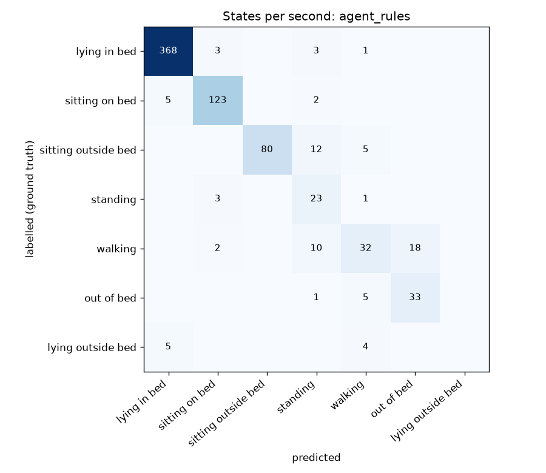
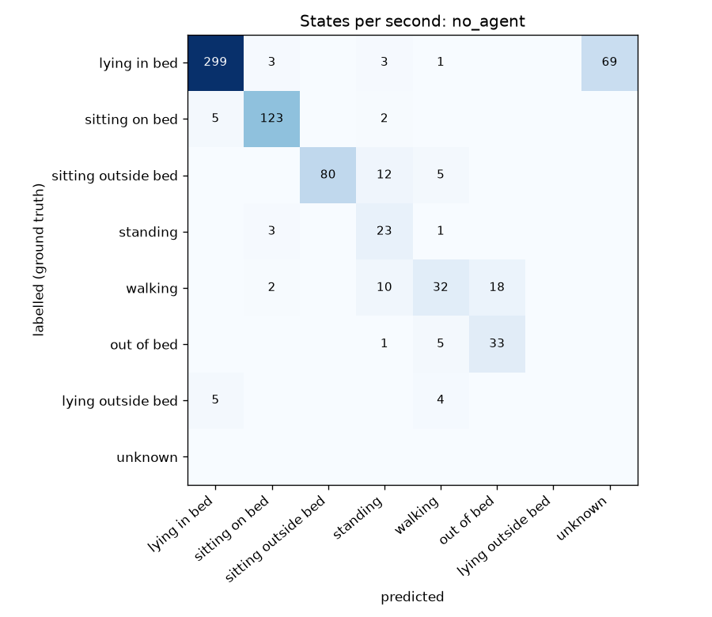

# Evaluation results

Labels: `data/ground_truth/test2_segments.csv`. Generated by `src/evaluate.py`.

## Comparison

| Run | State accuracy | Macro F1 | In/out of bed accuracy | Exit precision | Exit recall | False exits | Return precision | Return recall | Agent tool calls | Gemini calls |
|---|---|---|---|---|---|---|---|---|---|---|
| no_agent | 80% | 0.58 | 88% | 33% | 100% | 2 | 50% | 100% | 0 | 0 |
| agent_rules | 89% | 0.68 | 98% | 33% | 100% | 2 | 50% | 100% | 40 | 0 |
| agent_rules_vlm | 89% | 0.68 | 98% | 33% | 100% | 2 | 50% | 100% | 40 | 0 |
| agent_llm | 81% | 0.58 | 90% | 33% | 100% | 2 | 50% | 100% | 50 | 69 |

## Details

### Run `agent_rules`

Scored 739 s. State accuracy **89%**, macro F1 **0.68**, in/out of bed accuracy **98%**.

| State | Precision | Recall | F1 | Labelled seconds |
|---|---|---|---|---|
| LYING_IN_BED | 0.97 | 0.98 | 0.98 | 375 |
| SITTING_ON_BED | 0.94 | 0.95 | 0.94 | 130 |
| SITTING_OUTSIDE_BED | 1.00 | 0.82 | 0.90 | 97 |
| STANDING | 0.45 | 0.85 | 0.59 | 27 |
| WALKING | 0.67 | 0.52 | 0.58 | 62 |
| OUT_OF_BED | 0.65 | 0.85 | 0.73 | 39 |
| LYING_OUTSIDE_BED | 0.00 | 0.00 | 0.00 | 9 |

Confusion between similar states (seconds):

| A | B | labelled A, predicted B | labelled B, predicted A |
|---|---|---|---|
| SITTING_ON_BED | LYING_IN_BED | 5 | 3 |
| STANDING | WALKING | 1 | 10 |
| SITTING_ON_BED | STANDING | 2 | 3 |
| SITTING_OUTSIDE_BED | STANDING | 12 | 0 |
| LYING_OUTSIDE_BED | LYING_IN_BED | 5 | 0 |

Bed events (match within tolerance):

| Event | Labelled | Predicted | Matched | Precision | Recall | Timing errors | False | Missed |
|---|---|---|---|---|---|---|---|---|
| bed_exit | 1 | 3 | 1 | 33% | 100% | +2s | 06:48, 11:18 | - |
| return_to_bed | 1 | 2 | 1 | 50% | 100% | +4s | 07:08 | - |

Duration per state over the scored seconds:

| State | Labelled | Predicted | Error |
|---|---|---|---|
| LYING_IN_BED | 06:15 | 06:18 | 3 s |
| SITTING_ON_BED | 02:10 | 02:11 | 1 s |
| SITTING_OUTSIDE_BED | 01:37 | 01:20 | 17 s |
| STANDING | 00:27 | 00:51 | 24 s |
| WALKING | 01:02 | 00:48 | 14 s |
| OUT_OF_BED | 00:39 | 00:51 | 12 s |
| LYING_OUTSIDE_BED | 00:09 | 00:00 | 9 s |

### Run `no_agent`

Scored 739 s. State accuracy **80%**, macro F1 **0.58**, in/out of bed accuracy **88%**.

| State | Precision | Recall | F1 | Labelled seconds |
|---|---|---|---|---|
| LYING_IN_BED | 0.97 | 0.80 | 0.87 | 375 |
| SITTING_ON_BED | 0.94 | 0.95 | 0.94 | 130 |
| SITTING_OUTSIDE_BED | 1.00 | 0.82 | 0.90 | 97 |
| STANDING | 0.45 | 0.85 | 0.59 | 27 |
| WALKING | 0.67 | 0.52 | 0.58 | 62 |
| OUT_OF_BED | 0.65 | 0.85 | 0.73 | 39 |
| LYING_OUTSIDE_BED | 0.00 | 0.00 | 0.00 | 9 |
| UNKNOWN | 0.00 | 0.00 | 0.00 | 0 |

Confusion between similar states (seconds):

| A | B | labelled A, predicted B | labelled B, predicted A |
|---|---|---|---|
| SITTING_ON_BED | LYING_IN_BED | 5 | 3 |
| STANDING | WALKING | 1 | 10 |
| SITTING_ON_BED | STANDING | 2 | 3 |
| SITTING_OUTSIDE_BED | STANDING | 12 | 0 |
| LYING_OUTSIDE_BED | LYING_IN_BED | 5 | 0 |

Bed events (match within tolerance):

| Event | Labelled | Predicted | Matched | Precision | Recall | Timing errors | False | Missed |
|---|---|---|---|---|---|---|---|---|
| bed_exit | 1 | 3 | 1 | 33% | 100% | +2s | 06:48, 11:18 | - |
| return_to_bed | 1 | 2 | 1 | 50% | 100% | +4s | 07:08 | - |

Duration per state over the scored seconds:

| State | Labelled | Predicted | Error |
|---|---|---|---|
| LYING_IN_BED | 06:15 | 05:09 | 66 s |
| SITTING_ON_BED | 02:10 | 02:11 | 1 s |
| SITTING_OUTSIDE_BED | 01:37 | 01:20 | 17 s |
| STANDING | 00:27 | 00:51 | 24 s |
| WALKING | 01:02 | 00:48 | 14 s |
| OUT_OF_BED | 00:39 | 00:51 | 12 s |
| LYING_OUTSIDE_BED | 00:09 | 00:00 | 9 s |
| UNKNOWN | 00:00 | 01:09 | 69 s |

### Run `agent_llm`

Scored 739 s. State accuracy **81%**, macro F1 **0.58**, in/out of bed accuracy **90%**.

| State | Precision | Recall | F1 | Labelled seconds |
|---|---|---|---|---|
| LYING_IN_BED | 0.97 | 0.82 | 0.89 | 375 |
| SITTING_ON_BED | 0.94 | 0.95 | 0.94 | 130 |
| SITTING_OUTSIDE_BED | 1.00 | 0.82 | 0.90 | 97 |
| STANDING | 0.45 | 0.85 | 0.59 | 27 |
| WALKING | 0.67 | 0.52 | 0.58 | 62 |
| OUT_OF_BED | 0.65 | 0.85 | 0.73 | 39 |
| LYING_OUTSIDE_BED | 0.00 | 0.00 | 0.00 | 9 |
| UNKNOWN | 0.00 | 0.00 | 0.00 | 0 |

Confusion between similar states (seconds):

| A | B | labelled A, predicted B | labelled B, predicted A |
|---|---|---|---|
| SITTING_ON_BED | LYING_IN_BED | 5 | 3 |
| STANDING | WALKING | 1 | 10 |
| SITTING_ON_BED | STANDING | 2 | 3 |
| SITTING_OUTSIDE_BED | STANDING | 12 | 0 |
| LYING_OUTSIDE_BED | LYING_IN_BED | 5 | 0 |

Bed events (match within tolerance):

| Event | Labelled | Predicted | Matched | Precision | Recall | Timing errors | False | Missed |
|---|---|---|---|---|---|---|---|---|
| bed_exit | 1 | 3 | 1 | 33% | 100% | +2s | 06:48, 11:18 | - |
| return_to_bed | 1 | 2 | 1 | 50% | 100% | +4s | 07:08 | - |

Duration per state over the scored seconds:

| State | Labelled | Predicted | Error |
|---|---|---|---|
| LYING_IN_BED | 06:15 | 05:19 | 56 s |
| SITTING_ON_BED | 02:10 | 02:11 | 1 s |
| SITTING_OUTSIDE_BED | 01:37 | 01:20 | 17 s |
| STANDING | 00:27 | 00:51 | 24 s |
| WALKING | 01:02 | 00:48 | 14 s |
| OUT_OF_BED | 00:39 | 00:51 | 12 s |
| LYING_OUTSIDE_BED | 00:09 | 00:00 | 9 s |
| UNKNOWN | 00:00 | 00:59 | 59 s |
