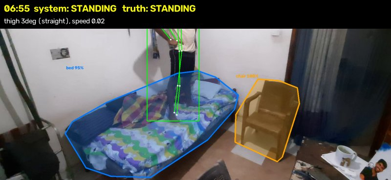
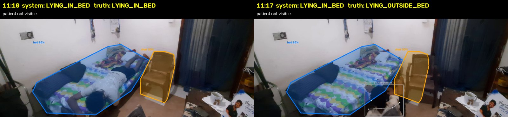
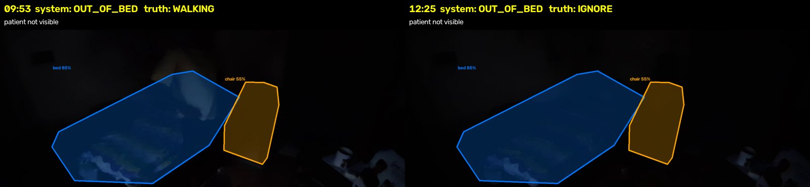
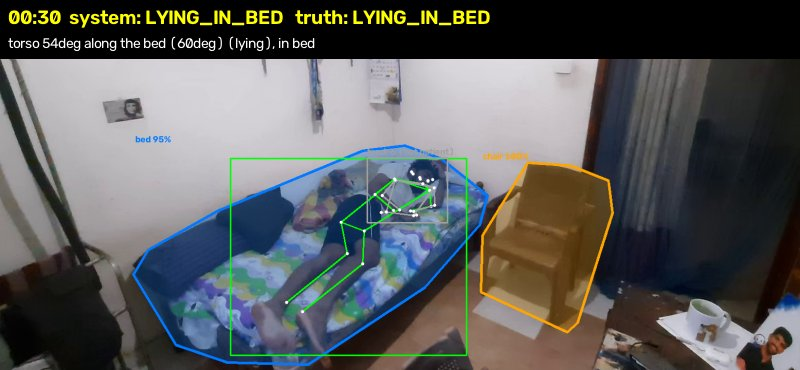
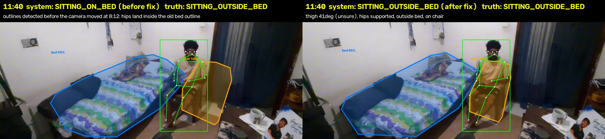

# Failure cases

From `test 2.mp4` (13 min), run with the rule-policy agent, compared with my
labels. Frames: green skeleton = the person the system treats as the patient,
grey = other detections, blue = detected bed, orange = detected chair. The top
line shows the system's state and the labelled truth.

Cases 1-3 are still open. Cases 4-5 broke the first version and were fixed;
they're kept here because they show what goes wrong with 2D geometry. Case 6
is about the LLM agent.

---

## 1. Standing on the bed counted as a bed exit

**When:** 6:48-7:08. **Truth:** standing on top of the mattress, then sitting
back down. Not a bed exit. **System:** STANDING, then a bed exit confirmed at
6:58 (after 10 s of standing) and a return to bed at 7:08. One false exit
and one false return, plus a MONITOR decision.

**Why:** the states only describe posture. Any standing counts as "out of bed"
in the bed-status layer, and the system has no notion of *where the feet are*.
In 2D, someone standing on the bed and someone standing just in front of it
look the same.

**Would vision fix it?** Yes. Asked afterwards with three frames, Gemini said
"standing on the bed itself, feet clearly on the mattress" (confidence 1.0).
The agent didn't ask because the exit's confidence (0.69) was above the 0.6
threshold for investigating.

**Fix with more time:** send every bed event to the agent (only a few per
night), and add an "on the bed / on the floor" field to the VLM's answer, so a
standing-on-bed exit can be rejected. A geometry alternative: check whether the
ankles are inside the bed outline and above the bed's lower edge.

---

## 2. Fall off the bed, hidden behind the bed, missed

**When:** 11:13-11:22. **Truth:** rolled off the far side of the bed onto the
floor, sat up, got up. **System:** LYING_IN_BED until 11:18, then WALKING. No
possible-fall ALERT.

**Why, step by step:**
1. On the floor behind the bed, most of my body is hidden by the bed. YOLO
   only finds a fragment, and ByteTrack gives it a new track ID.
2. That new track overlaps with my last position in time, so it isn't linked
   to the patient: from the system's point of view the patient vanished.
3. The **blanket hold** (keep LYING_IN_BED for up to 30 s if a lying patient
   disappears) then says "still lying in bed". It was designed for a duvet
   pulled over the head; here it hides a fall.
4. When I reappear, sitting on the floor with my legs hidden by the bed and
   moving, the rules read it as walking.

**Would vision fix it?** Yes: Gemini on 11:15-11:19 said "sitting on the
floor next to the bed" (1.0).

**Fix with more time:** don't apply the blanket hold if the patient's last
position was at the bed edge and the box was moving downward; treat "patient
vanished from the bed edge" as a trigger for the agent (and the VLM). This is
the most important open issue because it's a safety case.

---

## 3. Low light: walking read as "out of view"

**When:** 9:49-10:00 (left) and 12:23-12:52 (right). **Truth:** walking back to
bed in a dim room; later, sitting in a completely dark room. **System:**
OUT_OF_BED for both. The first is 11 of the 18 seconds of "walking predicted
as out of bed" in the confusion matrix. The second is excluded from scoring
(nobody could label it from the video).

**Why:** YOLO-pose stops detecting a person when the frame is that dark. "Not
detected after leaving the bed" is the definition of OUT_OF_BED.

**Would vision fix it?** For the dim part, possibly; for the dark part, no.
Gemini on the dark frames: UNKNOWN, 0.1, "almost completely dark". That is
the honest answer, and better than OUT_OF_BED.

**Fix with more time:** measure frame brightness, and when it's too dark say
UNKNOWN ("can't see") instead of OUT_OF_BED ("gone"). After a minute that
becomes MONITOR through the existing rule. Real deployments use an infrared
camera at night.

---

## 4. (Fixed) Lying in bed read as standing: perspective

**When:** 0:09-1:02 in the first version. **Truth:** lying in bed. **System
before the fix:** STANDING for a minute, then flickering between lying and
sitting until 3:08, plus a false "return to bed" at 1:02.

**Why:** the bed points diagonally toward the camera. Lying along it, my
torso measured only 49-55 degrees from vertical in the image; the "lying"
threshold was 60 degrees. With straight legs, the rules chose STANDING.

**Fix (decision D31):** in bed, a torso lined up with the bed's long axis
(64 degrees here, from the rotated rectangle around the detected bed) also
counts as lying. Upright postures measured at most 19 degrees, so the margin
is wide. 0:06-5:14 is now one LYING_IN_BED segment.

---

## 5. (Fixed) Camera nudged: bed outline no longer lines up

**When:** the phone moved about 45 px at 8:10. **Left:** the bed and chair
outlines detected before the move, drawn on a frame from 11:40: my hips now
fall inside the old bed outline, and the first version said SITTING_ON_BED
for the whole chair sit (11:39-12:24), with a fake return and exit.
**Right:** after the fix.

**Fix (decision D32):** every 2 s a small grey frame is compared with a
reference by phase correlation; a lasting shift of more than 20 px starts a
new camera position, and the bed and seats are detected again for it. The
move was found at 8:12 (and the phone pick-up in my first test clip at 0:52).

---

## 6. LLM agent: reasoning and answer disagree

**When:** 3:45-4:44, 59 s fully under the blanket (YOLO sees nobody).

**Rule policy:** lying in bed before and after, nobody seen leaving, so
LYING_IN_BED. Correct.

**LLM policy (Gemini 2.5 Flash choosing the tools):** made the same three
tool calls, and concluded:

> RESOLVED -> UNKNOWN (confidence 1.0): "The patient was lying in bed before
> and after the unknown stretch. [...] This suggests the patient remained in
> bed, but the camera view was obstructed [...]"

Its reasoning says "in bed", its answer says UNKNOWN. That one investigation
costs 59 s, which is the whole gap between the two policies (89% vs 81%). The
code check on the LLM's conclusion kept it harmless (UNKNOWN changes nothing),
but the right answer was lost.

**Lesson:** an LLM's free-text reasoning is not the same as its structured
answer; both need checking. I didn't tune the prompt to fix it, because this
is the evaluation video.
